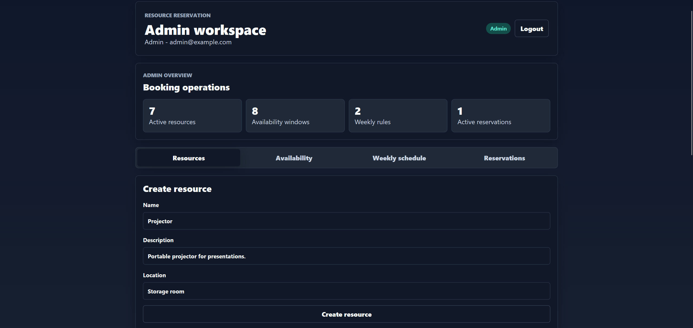
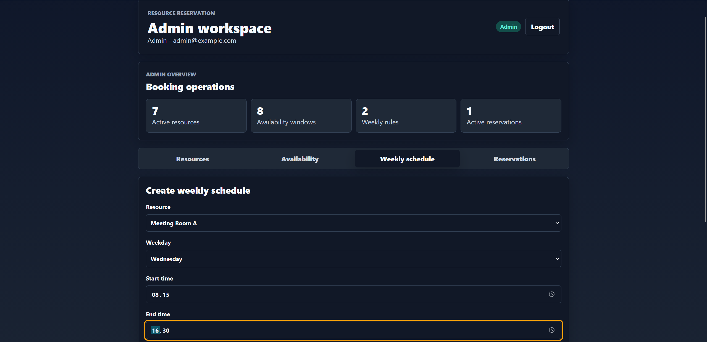
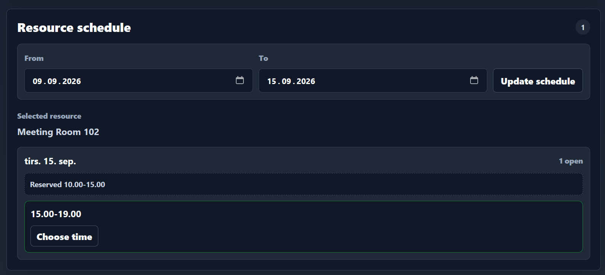
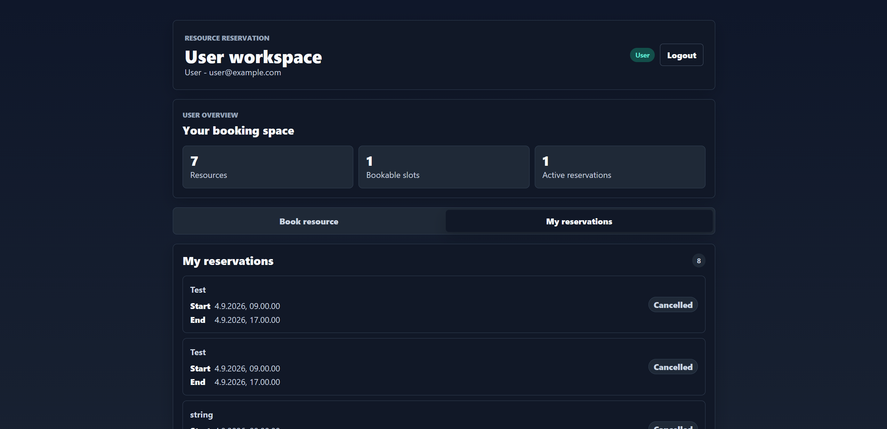

# Resource Reservation System

A finished full-stack MVP for reserving shared resources, built with ASP.NET Core Web API, SQL Server, React, TypeScript, and JWT authentication.

The project is designed as a portfolio project. It demonstrates practical backend development, relational database design, authentication, role-based authorization, frontend integration, validation, and automated verification in a realistic booking workflow.

## MVP Status

This project is complete as an MVP.

The application supports the core flow for a generic resource reservation system:

- Admins manage bookable resources
- Admins define one-off availability windows
- Admins define weekly availability rules, such as Monday to Friday from 08:00 to 16:00
- Users choose a resource first, then view generated bookable times
- Users create and cancel their own reservations
- Admins view and manage all reservations
- The backend prevents overlapping active reservations
- Cancelled reservations no longer block new reservations

The project intentionally stays generic. A resource can represent a meeting room, workspace, vehicle, sports court, equipment item, or another shared asset.

## Screenshots

### Admin Resource Management



### Admin Weekly Schedule



### User Resource Booking



### User Reservations



## Features

### Authentication And Authorization

- User registration
- User login
- JWT-based authentication
- Role-based access for Admin and User behavior
- Seeded development Admin account

### Admin Features

- Create, edit, and delete resources
- Mark resources active or inactive
- Create, edit, and delete one-off availability windows
- Create, edit, and delete weekly availability rules
- View all reservations
- Filter reservations by resource and status
- Cancel any active reservation

### User Features

- View active resources
- Select a resource before choosing a reservation time
- Load generated bookable times for a date range
- View schedule-style availability grouped by day
- Choose a time inside a bookable slot
- Create reservations
- View own reservations
- Cancel own active reservations

### Backend Rules

- Reservations require an active resource
- Reservation end time must be after start time
- Reservations must fit inside either a one-off availability window or a weekly availability rule
- Active overlapping reservations are rejected
- Cancelled reservations do not block new reservations
- Resources with reservation history cannot be deleted and should be marked inactive instead

## Tech Stack

### Backend

- ASP.NET Core Web API
- C#
- Entity Framework Core
- SQL Server LocalDB
- JWT authentication
- Swagger / OpenAPI
- xUnit tests

### Frontend

- React
- TypeScript
- Vite
- Playwright smoke tests
- ESLint

### Tooling

- GitHub Actions
- Visual Studio / .NET CLI
- SQL Server LocalDB
- SQL Server Management Studio

## Project Structure

```text
backend/
  ResourceReservation.Api/
    Controllers/
    Data/
    DTOs/
    Migrations/
    Models/

  ResourceReservation.Api.Tests/

frontend/
  resource-reservation-client/
    src/
      api/
      auth/
      components/
      views/
    tests/
      smoke/

docs/
  planning.md
  roadmap.md
```

## Architecture Overview

The application is split into a backend API, a SQL Server database, and a React frontend.

The backend owns the business rules. It exposes endpoints for authentication, resources, availability windows, weekly availability rules, generated resource schedules, and reservations.

SQL Server stores users, resources, availability windows, weekly rules, and reservations. Entity Framework Core maps the C# models to database tables and manages migrations.

The frontend provides role-based workflows. Admin users manage the booking setup. Normal users select a resource, view generated availability, and reserve a valid time slot.

## Domain Model

- `User` - a person who can log in and create reservations
- `Resource` - something that can be reserved
- `Availability` - a one-off date/time window where a resource can be booked
- `AvailabilityRule` - a recurring weekly rule for a resource, such as Monday 08:00-16:00
- `Reservation` - a concrete booking made by a user for a resource

## API Overview

### Auth

```text
POST /api/auth/register
POST /api/auth/login
```

### Resources

```text
GET    /api/resources
GET    /api/resources/{id}
GET    /api/resources/{id}/schedule?from=YYYY-MM-DD&to=YYYY-MM-DD
POST   /api/resources        Admin only
PUT    /api/resources/{id}   Admin only
DELETE /api/resources/{id}   Admin only
```

### Availability Windows

```text
GET    /api/availabilities
GET    /api/availabilities/{id}
POST   /api/availabilities        Admin only
PUT    /api/availabilities/{id}   Admin only
DELETE /api/availabilities/{id}   Admin only
```

### Weekly Availability Rules

```text
GET    /api/availabilityrules
GET    /api/availabilityrules/{id}
POST   /api/availabilityrules        Admin only
PUT    /api/availabilityrules/{id}   Admin only
DELETE /api/availabilityrules/{id}   Admin only
```

### Reservations

```text
GET /api/reservations                    Admin only
GET /api/reservations/{id}               Owner or Admin
GET /api/reservations/me                 Logged-in user
POST /api/reservations                   Logged-in user
PUT /api/reservations/{id}/cancel        Owner or Admin
GET /api/reservations/resource/{id}      Admin only
GET /api/reservations/user/{id}          Admin only
```

## Local Setup

### Prerequisites

- .NET SDK matching the project target framework
- Node.js
- SQL Server LocalDB

### Backend

From the repository root:

```bash
dotnet restore ResourceReservationSystem.slnx
dotnet ef database update --project backend/ResourceReservation.Api --startup-project backend/ResourceReservation.Api
dotnet run --project backend/ResourceReservation.Api/ResourceReservation.Api.csproj
```

Swagger is available in development at:

```text
http://localhost:5052/swagger
```

Development connection string:

```text
Server=(localdb)\MSSQLLocalDB;Database=ResourceReservationDb;Trusted_Connection=True;TrustServerCertificate=True
```

### Development Admin User

The development Admin user is seeded from `appsettings.Development.json`:

```json
"SeedAdmin": {
  "Name": "Admin",
  "Email": "admin@example.com",
  "Password": "Admin1234"
}
```

### Frontend

Start the backend first. Then run:

```bash
cd frontend/resource-reservation-client
npm install
npm run dev
```

The Vite development server usually runs at:

```text
http://localhost:5173
```

The frontend expects the API at:

```text
http://localhost:5052/api
```

This can be overridden with `VITE_API_BASE_URL`.

## Verification

Backend tests:

```bash
dotnet test ResourceReservationSystem.slnx
```

Frontend checks:

```bash
cd frontend/resource-reservation-client
npm run lint
npm run build
npm run test:smoke
```

The Playwright smoke tests cover the main browser flow: Admin login, resource management, weekly schedule management, availability management, User registration/login, resource-first booking, reservation cancellation, and overlap error handling.

## Continuous Integration

GitHub Actions runs on push and pull request.

The workflow restores and tests the backend, installs frontend dependencies, runs lint, and builds the frontend. Pull requests fail if any check fails.

## Deployment Notes

This project is prepared as a portfolio application, not a live production deployment.

For production-like hosting:

- Use a real SQL Server database instead of LocalDB
- Configure `ConnectionStrings:DefaultConnection` through the hosting environment
- Configure JWT settings and secrets outside source control
- Set `VITE_API_BASE_URL` to the deployed backend URL
- Build the frontend as static files with `npm run build`

## Potential Future Improvements

These are intentionally outside the finished MVP, but would make good future issues:

- Availability exceptions for holidays, maintenance, or one-off closures
- Resource categories and filtering
- Better calendar controls for week/month navigation
- Reservation editing or rescheduling
- Admin analytics or utilization overview
- Calendar export
- Email notifications
- Docker setup
- Production deployment
- Multi-tenant organization support

## Portfolio Notes

This project is meant to show a complete, understandable MVP rather than an oversized production system.

It demonstrates:

- Full-stack feature development
- API design with DTOs
- Entity Framework Core migrations
- SQL Server persistence
- Authentication and authorization
- Business-rule validation
- Frontend state management
- Automated backend and frontend verification
